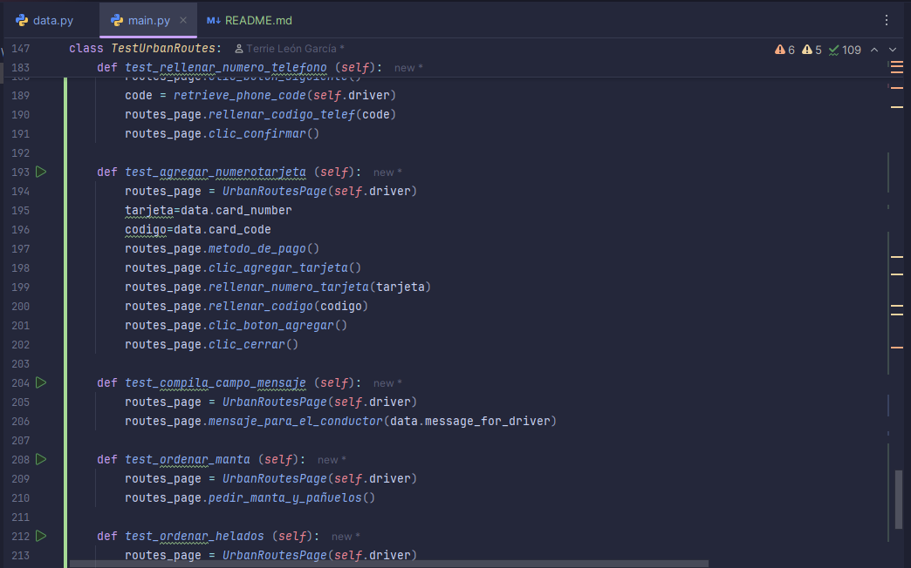

# Proyecto: Urban Routes - Pruebas Automatizadas

## Descripción del proyecto
Urban Routes es una aplicación de taxis, por lo cual este proyecto trata de automatizar el servicio para solicitar un taxi en la aplicación utilizando Selenium WebDriver con estructura POM. Se validaron acciones clave como selección de tarifa, ingreso de datos, pago con tarjeta y solicitud de extras, incluyendo la lógica de activación del botón de pago por pérdida de enfoque.
Entre las funcionalidades automatizadas se encuentran: selección de tarifa “Comfort”, ingreso de teléfono, adición de tarjeta de crédito (validando el flujo de activación por pérdida de enfoque del campo CVV) y otras más.

## Resultados Destacados:

- Automatización completa del flujo de solicitud y reserva con validación de elementos dinámicos. 
- Simulación de métodos de pago con verificación y activación de botones.
- Definición de localizadores y métodos necesarios para la clase `UrbanRoutesPage`
- Pruebas implementadas en `Main.py` con estructura POM. (`TestUrbanRoutes`)

## Tecnologías y técnicas utilizadas

- **Python**: Lenguaje de programación principal
- **pytest**: Framework para ejecutar las pruebas automatizadas
- **PyCharm**: Entorno de desarrollo
- **Selenium WebDriver**: Interacción con elementos web
- **GitHub**: Repositorio remoto para el código

<p>


</p>


## Estructura del proyecto

- `data.py`: Datos de prueba y configuración
- `main.py`: Archivo principal con las pruebas automatizada
- `README.md`: Descripción del proyecto e instrucciones para ejecutar las pruebas.



## Cómo ejecutar las pruebas

1. Asegúrate de tener Python instalado
2. Instala las dependencias necesarias
3. Configurar el driver de Selenium
4. Ejecuta las pruebas con el comando:

```bash
pytest main.py
Autor
[Terrrie León García - Grupo 79a - Sprint 9] - Proyecto de automatización QA para TripleTen
```
## Reflexión personal
Este proyecto me permitió aplicar mis conocimientos en automatización de pruebas de extremo a extremo. Reforcé el uso de buenas prácticas como esperas explícitas y validación dinámica de elementos. Además, consolidé mi confianza en el uso de herramientas como Selenium y Pytest, simulando una experiencia real de usuario.
